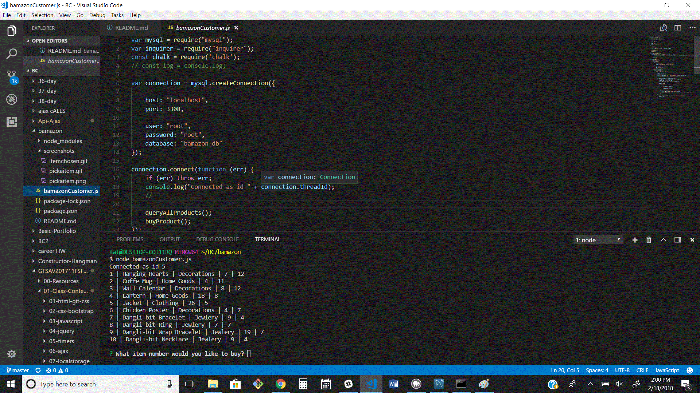
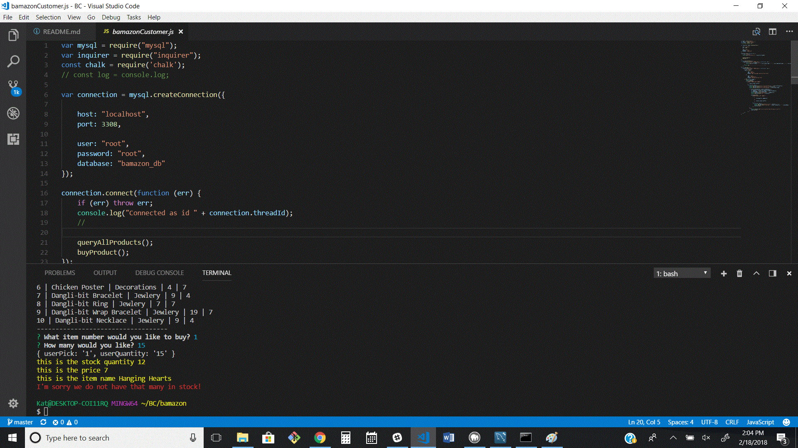
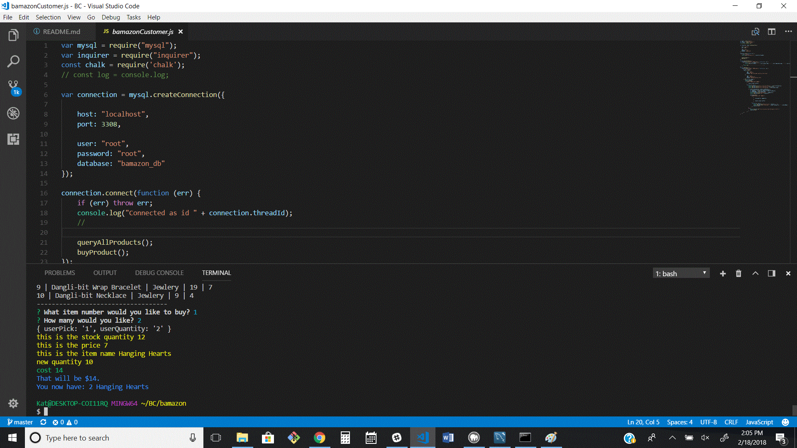

## MySql Database - Bamazon
# Customer
Contains a table with avaible products
The table is broken down into the following coulumns:

* item_id (unique id for each product)

* product_name (Name of product)

* department_name

* price (cost to customer)

* stock_quantity (how much of the product is available in stores)

Running node will first display all of the items available for sale. Including the ids, names, and prices of products for sale.

Next node prompts then users with two messages.

The first asks them the ID of the product they would like to buy.

The second message asks how many units of the product they would like to buy.

Once the customer has placed the order the application checks if the "store" has enough of the product to meet the customer's request.

If not, a notice of insufficient quatity appears - shown here in red

if the store does have enough of the product, the customers order is fulfilled and the total cost if shown - shown here in blue

*the yellow - shows info for the developer and can be commented out before app is deployed*

the databse is reduced by the number of items sold - * *here item number 1 is reduced from 12 to 10* *

