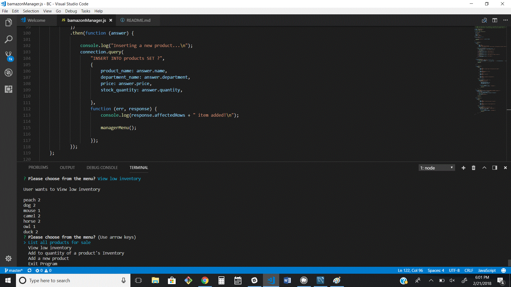

## MySql Database - Bamazon Store

# Customer
Contains a table with available products
The table is broken down into the following columns:

* item_id (unique id for each product)

* product_name (Name of product)

* department_name

* price (cost to customer)

* stock_quantity (how much of the product is available in stores)

Running node will first display all of the items available for sale. Including the ids, names, and prices of products for sale.

Next node prompts the users with two messages.

The first asks them the ID of the product they would like to buy.

The second message asks how many units of the product they would like to buy.

Once the customer has placed the order the application checks if the "store" has enough of the product to meet the customer's request.

If not, a notice of insufficient quatity appears - shown here in red

if the store does have enough of the product, the customers order is fulfilled and the total cost is shown - shown here in blue

*the yellow - shows info for the developer and can be commented out before app is deployed*

the databse is reduced by the number of items sold - * *here item number 1 is reduced from 12 to 10* *

## MySql Database - Bamazon
# Manager

Running this node application first
Lists a set of menu options:
* View Products for Sale
* View Low Inventory
* Add to Inventory
* Add New Product

If the user selects View Products for Sale, a list of every available item: the item IDs, names, prices, and quantities appears.

and the menu reappears

If the user selects View Low Inventory, then it lists all items with an inventory count lower than five.

and the menu reappears

If the user selects Add to Inventory, then the app prompts the user to add quantity to an item

and the menu reappears

If the user selects Add New Product, it prompts the user to add a completely new product to the store.

and the menu reappears

If the user selects exit program - it exits the program
